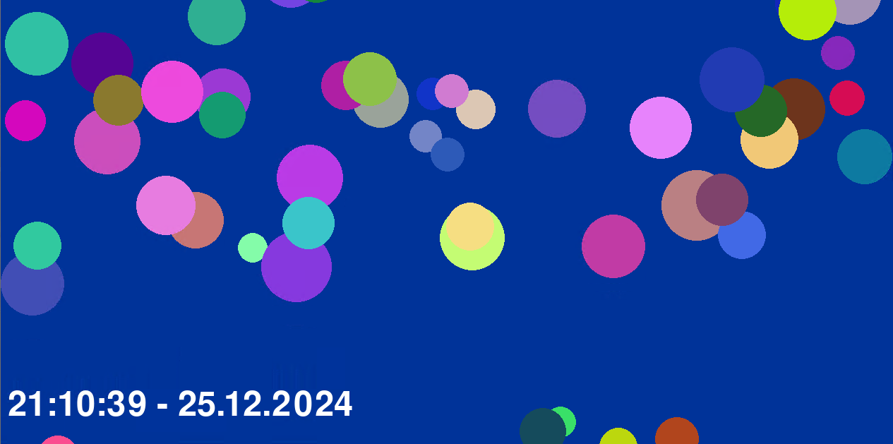

# Bubble Screensaver for Windows



## Author: Tobias Kisling (hasderhi)

## Introduction

This is a simple screensaver that displays a bubble animation. The animation is created by drawing a series
of circles with random radius and color. The animation is looped until the user stops it with any key input.

This is the main class for the bubble creation:

```python
class Bubble:
    def __init__(self):
        self.radius = random.randint(20, 50)
        self.x = random.randint(self.radius, width - self.radius)
        self.y = height + self.radius
        self.speed = random.uniform(1, 3)
        # Generate a random color for the bubble
        self.color = (random.randint(0, 255), random.randint(0, 255), random.randint(0, 255))

    def move(self):
        self.y -= self.speed
        if self.y < -self.radius:
            self.y = height + self.radius
            self.x = random.randint(self.radius, width - self.radius)
            # Generate a new random color when the bubble resets
            self.color = (random.randint(0, 255), random.randint(0, 255), random.randint(0, 255))

    def draw(self, surface):
        pygame.draw.circle(surface, self.color, (int(self.x), int(self.y)), self.radius)
```

## How to use

### Installing and running

1. Windows Executable (```.exe```)

    1. Download the program from the latest release
    2. Unzip the downloaded files
    3. Run the executable file

2. Python file (```.py```, ```.pyw```)

    1. Install the required libraries by running `pip install pygame` in the windows cmd
    2. Run the script by double-clicking the file or by running it in the cmd

## Information

This software is written by Tobias Kisling (Github: hasderhi)
Please report bugs here:
<https://github.com/hasderhi/bubble-screensaver>

Released under the MIT-License.
